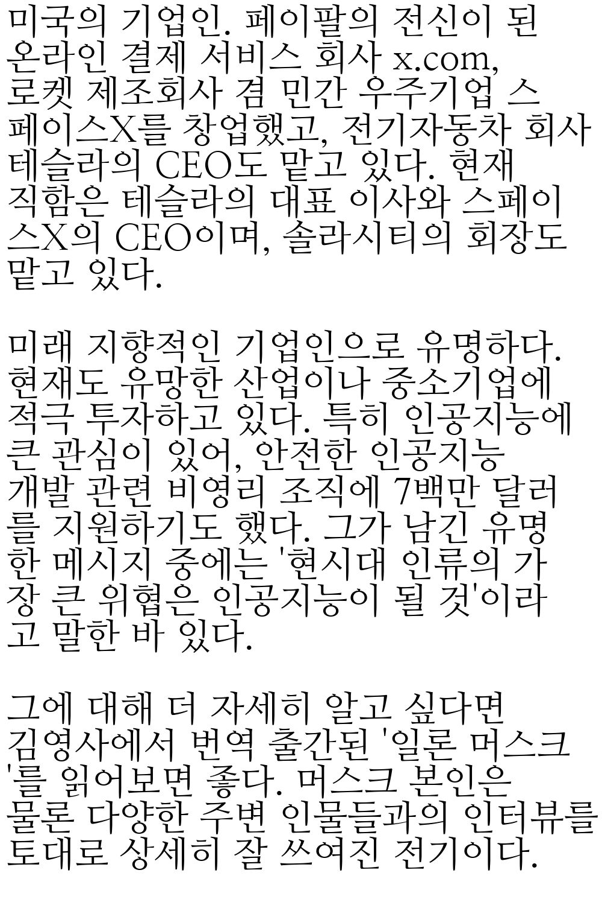
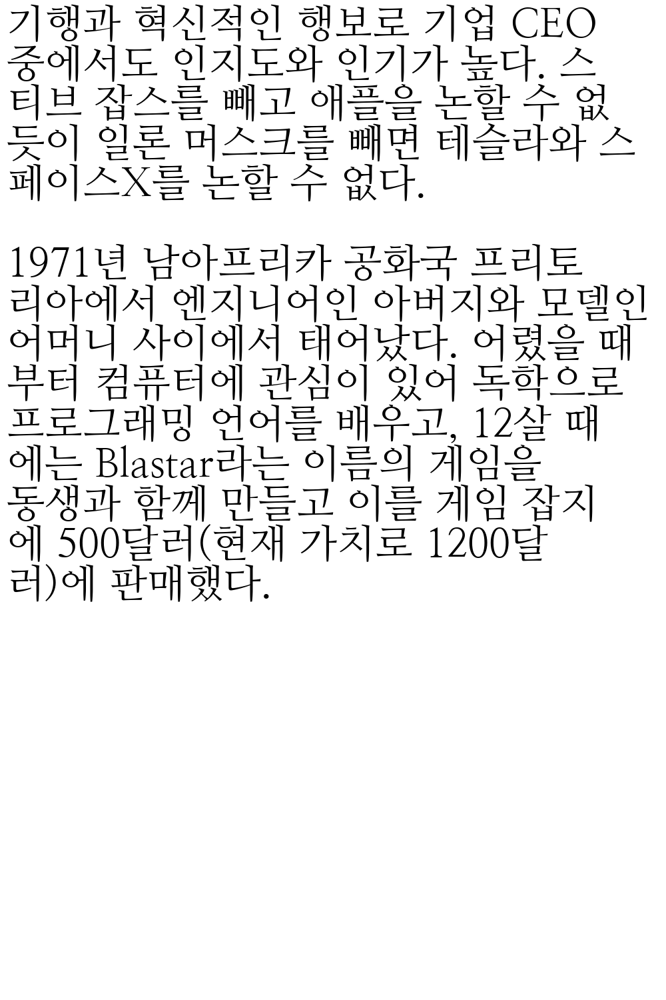

# 📘 Backend service for Readvalley

## Requirements

- Python3
- PIL
- OpenCV
- [Bento4](https://github.com/axiomatic-systems/Bento4)

## POST book/register
Register information for Book

## POST book/publish  ⇒ Main DRM Logic
1. User uploads book article as plaintext
2. Render article as images, cropped to regular sizes

3. Add invisible image watermarks

4. Convert each image as one-frame MP4 video
5. Pack each video as MPEG-CENC content, using kid & key
6. Upload the kid, key to database
7. Call the contract function `addBook` for blockchain register
8. Update field `isPublished` for BookModel
